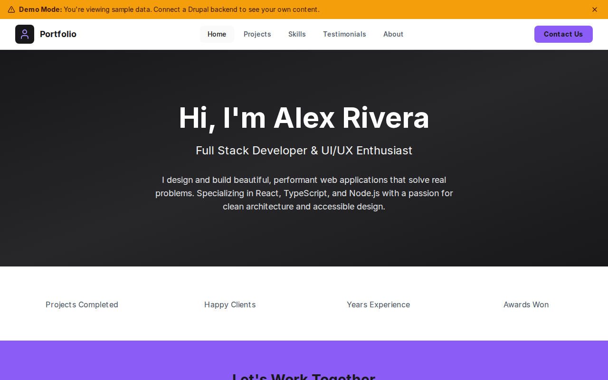

# Decoupled Portfolio

A personal portfolio and case study website built with Next.js and Drupal. Designed for developers, designers, and freelancers who want to showcase their projects, skills, and client testimonials with a modern, fast-loading frontend backed by a structured CMS.



[](https://vercel.com/new/clone?repository-url=https://github.com/nextagencyio/decoupled-portfolio&project-name=my-portfolio)

## Features

- **Projects & Case Studies** -- Showcase completed work with client names, technologies used, live URLs, GitHub links, and categorized by type (Web Application, Mobile App, E-Commerce, SaaS, Open Source, Design System)
- **Skills & Proficiencies** -- Display technical skills with proficiency levels, years of experience, and category groupings
- **Client Testimonials** -- Feature client feedback with photos, titles, companies, star ratings, and linked project references
- **Homepage with Hero & Stats** -- Configurable landing page with hero section, statistics counters, featured projects, and call-to-action blocks
- **Static Pages** -- About, Contact, and Resume pages managed through the CMS

## Quick Start

### 1. Clone the template

```bash
npx degit nextagencyio/decoupled-portfolio my-portfolio
cd my-portfolio
npm install
```

### 2. Run interactive setup

```bash
npm run setup
```

This interactive script will:
- Authenticate with Decoupled.io (opens browser)
- Create a new Drupal space
- Wait for provisioning (~90 seconds)
- Configure your `.env.local` file
- Import sample content

### 3. Start development

```bash
npm run dev
```

Visit [http://localhost:3000](http://localhost:3000)

---

## Manual Setup

If you prefer to run each step manually:

<details>
<summary>Click to expand manual setup steps</summary>

### Authenticate with Decoupled.io

```bash
npx decoupled-cli@latest auth login
```

### Create a Drupal space

```bash
npx decoupled-cli@latest spaces create "My Portfolio"
```

Note the space ID returned (e.g., `Space ID: 1234`). Wait ~90 seconds for provisioning.

### Configure environment

```bash
npx decoupled-cli@latest spaces env 1234 --write .env.local
```

### Import content

```bash
npm run setup-content
```

This imports the following sample content:

- **Homepage** -- "Alex Rivera - Full Stack Developer" with hero, 4 stat counters, featured projects section, and CTA
- **Project: NutriTrack Health Dashboard** -- Health/nutrition tracking platform, React + D3.js + Node.js
- **Project: CraftMarket E-Commerce Platform** -- Artisan marketplace, Next.js + Medusa.js + Stripe Connect
- **Project: OpenForm - Open Source Form Builder** -- Self-hosted form builder, React + dnd-kit + Prisma
- **Skill: React & Next.js** -- Expert-level frontend proficiency
- **Skill: TypeScript** -- Advanced type system expertise
- **Skill: Node.js & Backend Development** -- Backend and API development
- **Testimonial: Sarah Kim (NutriTrack CTO)** -- 5-star review of dashboard project
- **Testimonial: Marcus Chen (CraftMarket CEO)** -- 5-star review of marketplace project
- **Testimonial: Lisa O'Connor (Horizon Foundation)** -- 5-star review of nonprofit website
- **About** -- Personal bio, journey, values, and interests
- **Contact** -- Email, LinkedIn, GitHub, Twitter, and availability info

</details>

## Content Types

### Homepage
Personal portfolio landing page with configurable sections.

| Field | Type | Description |
|-------|------|-------------|
| Hero Title | string | Main heading (e.g., "Hi, I'm Alex Rivera") |
| Hero Subtitle | string | Tagline or role description |
| Hero Description | text | Introductory paragraph |
| Hero Image | image | Profile or hero photo |
| Statistics | paragraph[] | Stat counters (number + label pairs) |
| Featured Items Title | string | Section heading for featured work |
| CTA Title | string | Call-to-action heading |
| CTA Description | text | CTA body copy |
| Primary/Secondary CTA | string | Button labels |

### Project
Portfolio project or case study with detailed information.

| Field | Type | Description |
|-------|------|-------------|
| Body | text | Full project description and results |
| Project Image | image | Hero/cover image |
| Project URL | string | Live project link |
| GitHub URL | string | Source code repository |
| Technologies | string[] | Tech stack used (React, TypeScript, etc.) |
| Client | string | Client or company name |
| Year | string | Project completion year |
| Role | string | Your role on the project |
| Category | taxonomy | Web Application, Mobile App, E-Commerce, SaaS, Open Source, Design System |

### Skill
Technology or proficiency listing.

| Field | Type | Description |
|-------|------|-------------|
| Body | text | Detailed description of expertise |
| Skill Icon | string | Icon identifier |
| Proficiency | string | Level (Expert, Advanced, Intermediate) |
| Years of Experience | string | Duration of experience |
| Skill Category | string | Grouping (Frontend, Backend, Languages, etc.) |

### Testimonial
Client feedback and recommendation.

| Field | Type | Description |
|-------|------|-------------|
| Body | text | Full testimonial text |
| Client Photo | image | Client headshot |
| Client Name | string | Full name |
| Client Title | string | Job title |
| Client Company | string | Company or organization |
| Rating | integer | Star rating (1-5) |
| Related Project | string | Associated project name |

## Customization

### Colors & Branding
Edit `tailwind.config.js` to customize your color palette, fonts, and spacing. The default theme uses violet accents with a zinc/gray base.

### Content Structure
Modify `data/portfolio-content.json` to change content types, fields, or sample data before importing.

### Components
React components are in `app/components/`. Key files:
- `HomepageRenderer.tsx` -- Landing page layout with hero, stats, and CTA
- `ProjectCard.tsx` -- Project listing card
- `SkillCard.tsx` -- Skill listing card
- `TestimonialCard.tsx` -- Testimonial listing card
- `Header.tsx` -- Navigation and site branding

## Demo Mode

Demo mode lets you showcase the portfolio without connecting to a Drupal backend. It displays mock content for all pages.

### Enable Demo Mode

```bash
NEXT_PUBLIC_DEMO_MODE=true
```

Or add to `.env.local`:
```
NEXT_PUBLIC_DEMO_MODE=true
```

### Removing Demo Mode

To switch to production with real CMS data:

1. Delete `lib/demo-mode.ts`
2. Delete `data/mock/` directory
3. Delete `app/components/DemoModeBanner.tsx`
4. Remove `DemoModeBanner` from `app/layout.tsx`
5. Remove demo mode checks from `app/api/graphql/route.ts`

## Deployment

### Vercel (Recommended)
[](https://vercel.com/new/clone?repository-url=https://github.com/nextagencyio/decoupled-portfolio)

Set `NEXT_PUBLIC_DEMO_MODE=true` in Vercel environment variables for a demo deployment.

### Other Platforms
Works with any Node.js hosting platform that supports Next.js.

## Documentation

- [Decoupled.io Docs](https://www.decoupled.io/docs)
- [Next.js Documentation](https://nextjs.org/docs)
- [Drupal GraphQL](https://www.decoupled.io/docs/graphql)

## License

MIT
